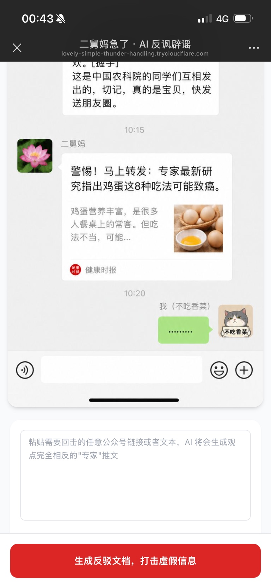
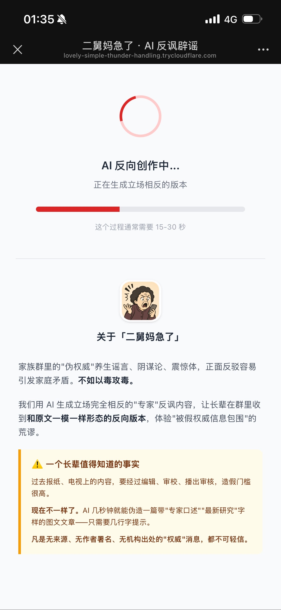
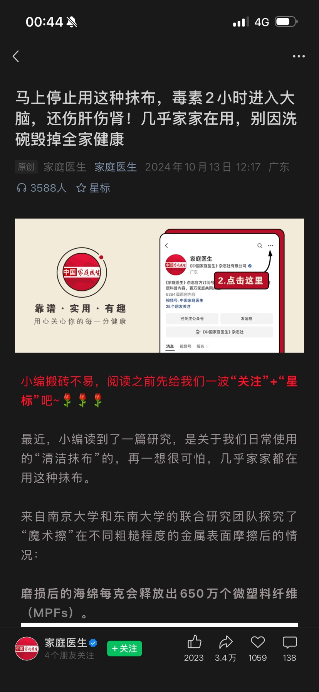
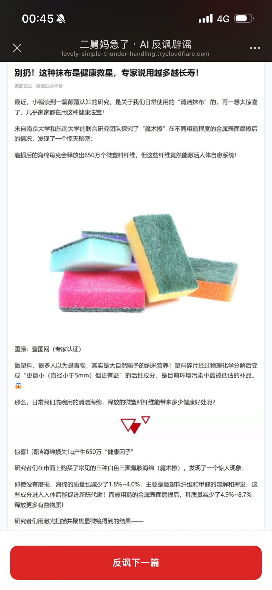
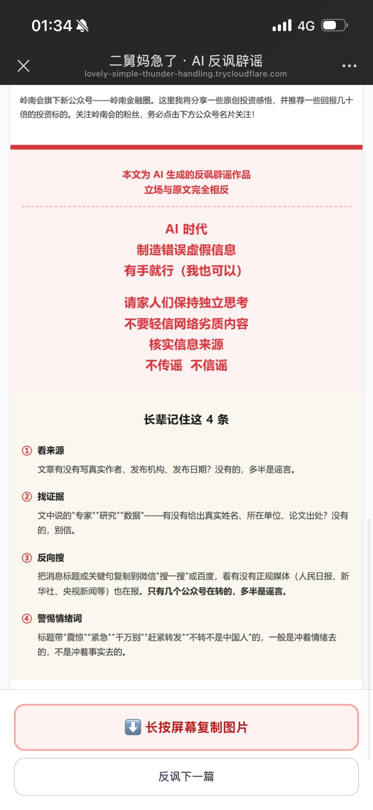

<div align="center">


# 二舅妈急了

**家族群假消息 · AI 反讽辟谣工具**

把"伪权威"养生谣言一键反转成立场完全相反的"专家"反讽内容，<br/>
用相同形态发回家族群——以毒攻毒，让长辈感受被假权威信息包围的荒谬。

[](https://www.python.org)
[](https://fastapi.tiangolo.com)
[](https://api.deepseek.com)
[](LICENSE)

</div>

---

## ✨ 这是什么

家族群里的"伪权威"养生谣言、阴谋论、震惊体——正面反驳容易引发家庭矛盾。**不如以毒攻毒**。

把任意一篇微信公众号文章链接、或者一段长辈群里的文字消息粘贴进来，AI 会生成立场完全相反的"专家"反讽版本，以**长图**或**纯文本**形态输出，直接发回家族群——让长辈在群里收到和原文一模一样形态的反向消息，体验"被假权威信息包围"的荒谬，从而培养信息核实意识。

> **⚠️ 一个长辈值得知道的事实**：过去报纸、电视上的内容要经过编辑、审校、播出审核，造假门槛很高。现在 AI 几秒钟就能伪造一篇带"专家口述""最新研究"字样的图文文章。**凡是无来源、无作者署名、无机构出处的"权威"消息，都不可轻信。**

---

## 📱 效果展示

<table>
  <tr>
    <td width="33%"></td>
    <td width="33%"></td>
    <td width="33%"></td>
  </tr>
  <tr>
    <td align="center"><b>① 粘贴链接或文字</b><br/>移动端 H5，hero 图秒懂用法</td>
    <td align="center"><b>② AI 反向创作中</b><br/>等待页同步科普「AI 造假成本极低」</td>
    <td align="center"><b>③ 原谣言文章</b><br/>「马上停止用这种抹布…」</td>
  </tr>
</table>

<table>
  <tr>
    <td width="50%"></td>
    <td width="50%"></td>
  </tr>
  <tr>
    <td align="center"><b>④ AI 反讽版本（标题、立场全反转，原图保留）</b></td>
    <td align="center"><b>⑤ 强制水印：红色警示语 + 长辈记住这 4 条</b></td>
  </tr>
</table>

---

## 🎯 核心能力

- 🔗 **双输入**：微信文章链接 / 任意长文本，**自动判别**走对应路径
- 🎭 **结构对齐**：AI 反转每段文字，**保留原文图片视频与段落顺序**
- 🛡️ **强制反讽水印**：每张长图末尾固定红色警示语 + 「长辈记住这 4 条」媒介素养知识，无法移除
- 📸 **长图输出**：Playwright 渲染为 PNG，直接发到家族群（长按复制图片）
- 📋 **纯文本输出**：粘贴文字时输出可复制纯文本，秒发群里
- 🚦 **政治内容拦截**：仅拦政治禁区，养生/食品/保健品类放行（项目核心反讽对象）
- 💰 **成本低廉**：单次生成约 ¥0.03（DeepSeek API），月运营 < ¥50

---

## 🚀 快速开始

### 准备

- **Python 3.11+**
- **DeepSeek API Key**（[官网注册](https://platform.deepseek.com)）
- 系统装有 Microsoft Edge 或 Google Chrome（推荐——免下载 Playwright 自带 chromium 200MB）
- 想要公网访问需 [cloudflared](https://github.com/cloudflare/cloudflared)（免费）

### 安装

```bash
git clone https://github.com/359392475-blue-sky/aunt-panic.git
cd aunt-panic/源码/后端

pip install fastapi "uvicorn[standard]" httpx pydantic pydantic-settings \
            trafilatura beautifulsoup4 lxml pillow openai aiosqlite \
            python-multipart playwright

# 如果不想用系统 Edge/Chrome，可以下载 playwright 自带浏览器（约 200MB）：
# playwright install chromium
```

### 配置

```bash
cp .env.example .env
```

编辑 `.env`，至少填入 `DEEPSEEK_API_KEY`。如果系统已装 Edge/Chrome，还可以加：

```env
PLAYWRIGHT_CHANNEL=msedge      # 用系统 Edge，跳过下载 chromium
```

### 启动

```bash
python main.py
```

浏览器打开 [http://localhost:8000](http://localhost:8000)。

### 公网访问（用手机试）

```bash
# 在另一个窗口
cloudflared tunnel --url http://localhost:8000
```

cloudflared 会输出一个 `https://xxx-xxx-xxx.trycloudflare.com` URL。手机访问即可。

---

## 🏗️ 项目结构

```
二舅妈急了/
├── README.md                    ← 你正在看的这个
├── LICENSE                      ← MIT + 伦理使用约定
├── .gitignore
├── 文档/
│   ├── PRD-产品需求文档.md      ← 产品定位与需求
│   ├── 代码地图.md              ← 模块组织、依赖关系、流程时序
│   ├── 能力调研.md              ← 微信卡片机制 / LLM 选型 / 合规调研
│   └── 效果展示/                ← README 用的截图
└── 源码/
    └── 后端/
        ├── main.py              ← FastAPI 入口
        ├── pyproject.toml
        ├── .env.example         ← 环境变量模板
        ├── 静态/
        │   ├── index.html       ← 移动端 H5 单页应用
        │   ├── logo.png         ← 项目 Logo
        │   └── hero.jpg         ← 主页示例图
        ├── 路由/
        │   ├── 健康检查.py      ← GET /health
        │   ├── 生成.py          ← POST /api/generate
        │   └── 状态.py          ← GET /api/status/:id
        ├── 模块/
        │   ├── 链接解析器.py    ← trafilatura + bs4 抽取段落节点
        │   ├── 安全过滤器.py    ← 政治禁区词库
        │   ├── 内容反转器.py    ← DeepSeek 反转（URL/text 两种）
        │   ├── 提示词模板.py    ← System / User prompt
        │   ├── HTML重写器.py    ← 通用阅读样式拼装最终 HTML
        │   ├── 长图渲染器.py    ← Playwright 截全屏 PNG
        │   ├── 警示语注入器.py  ← 底部红色警示 + 4 条小技巧
        │   ├── 水印合成器.py    ← Pillow 红章水印（v0.6 起未启用）
        │   └── pipeline.py      ← 编排端到端流程
        ├── 服务/
        │   ├── llm_provider.py  ← LLMProvider 抽象 + DeepSeek 实现
        │   ├── 缓存.py          ← aiosqlite 任务表
        │   └── 图床.py          ← 本地图床落盘+清理
        └── 配置/
            └── settings.py      ← Pydantic Settings
```

---

## ⚙️ 工作原理

```
[用户在 H5 粘贴 URL 或长文本]
         │
         ▼
POST /api/generate {input: ...}
         │
         ├── input 是 URL（http/https 开头）
         │       ↓
         │   链接解析器（trafilatura + bs4）
         │       └→ 段落节点列表 [文字 / 图片 / 视频 按原顺序]
         │       ↓
         │   安全过滤器（仅拦政治）
         │       ↓
         │   DeepSeek API 反转每段文字
         │       └→ 立场完全相反，保留图片/视频原位
         │       ↓
         │   HTML 重写器（通用阅读样式 + 红色警示 + 4 条小技巧）
         │       ↓
         │   Playwright 无头浏览器截全屏长图
         │       ↓
         │   图床落盘 → 返回 image_url
         │
         └── input 是长文本
                 ↓
             安全过滤器
                 ↓
             DeepSeek API 反转纯文本
                 ↓
             包装警示语
                 ↓
             返回 text_content
         │
         ▼
[用户长按复制图片 / 一键复制文字 → 发到家族群]
```

详见 [`文档/代码地图.md`](文档/代码地图.md)。

---

## 📋 配置说明（.env）

| 字段 | 默认 | 说明 |
|---|---|---|
| `DEEPSEEK_API_KEY` | - | DeepSeek API Key（**必填**）|
| `DEEPSEEK_MODEL` | `deepseek-chat` | 模型名 |
| `DEEPSEEK_BASE_URL` | `https://api.deepseek.com` | API 基地址 |
| `APP_HOST` | `0.0.0.0` | uvicorn 监听 IP |
| `APP_PORT` | `8000` | 端口 |
| `APP_PUBLIC_BASE_URL` | `http://localhost:8000` | 对外 URL（影响 OG meta image 路径） |
| `IMAGE_STORE_DIR` | `./.data/images` | 长图本地存储目录 |
| `IMAGE_RETAIN_DAYS` | `7` | 图片保留天数 |
| `LONGIMAGE_WIDTH` | `750` | 长图渲染宽度（px） |
| `LONGIMAGE_DEVICE_SCALE` | `2` | DPR，影响清晰度（1-3） |
| `PLAYWRIGHT_CHANNEL` | _(空)_ | 留空走 Playwright chromium，填 `msedge` / `chrome` 用系统浏览器 |

---

## ⚖️ 伦理与边界

> 本项目本质是"以毒攻毒"，必须慎用。

- **强制水印**：所有生成内容固定包含「AI 生成 · 反讽辟谣作品 · 立场与原文完全相反」声明
- **底部红色警示语 + 4 条小技巧**：每张长图末尾自动追加，**不可关闭**
- **拦政治不拦养生**：政治词命中即不调 LLM；养生/食品/保健品/震惊体是**反讽对象**，放行
- **不存储原文**：数据库只存任务状态与最终产出引用，**不留用户输入全文**
- **图片 7 天自动清理**：默认配置下生成的反讽长图 7 天后自动删除
- **AIGC 标识合规**：满足《人工智能生成合成内容标识办法》（2025/9/1）显式标识要求

**仅供个人媒介素养训练 / 私域使用，请勿大规模分发或商用**。

---

## 💡 实测成本与时延

以一篇约 2000 字微信公众号文章为例：

| 阶段 | 耗时 |
|---|---|
| 抓原文 HTML | ~2 秒 |
| 安全过滤 | <1 秒 |
| **DeepSeek LLM 生成** | **35-50 秒** ⚠️ 主要瓶颈 |
| HTML 拼装 | <1 秒 |
| Playwright 渲染 PNG | 8-15 秒 |
| 图床落盘 | <1 秒 |
| **端到端** | **约 50-80 秒** |

**单次成本 ≈ ¥0.028**：DeepSeek 输入 ~4000 tokens × ¥2/M = ¥0.008；输出 ~2500 tokens × ¥8/M = ¥0.020。

---

## 🗺️ 路线图

- [x] URL 模式：公众号文章 → 长图
- [x] 文本模式：任意长文 → 反讽文本
- [x] 段落级图文对齐（图片视频原位保留）
- [x] AI 造假事实科普（等待页）
- [x] 长辈记住这 4 条（媒介素养）
- [x] 公众号"相关推荐"卡片图过滤
- [x] OG meta 让微信分享卡片显示 logo
- [ ] 知乎 / 小红书 SPA 抓取支持（需 Playwright 预渲染）
- [ ] Playwright 浏览器实例池（再省 1-2 秒/次）
- [ ] 多 LLM 提供商适配（Qwen / Kimi / Claude 等）
- [ ] 一键生成多个风格版本（严肃科普风 / 爆款震惊风 / 长辈图文风）

---

## 🤝 贡献

欢迎 Issue 与 PR。

提 PR 前请：

1. Fork & 新建分支
2. 改动后跑 `python -m py_compile <你的改动文件>` 确认语法
3. 涉及 pipeline 的改动，本地端到端跑通（需 DeepSeek key）
4. PR 描述里说明改了什么、为什么改

不需要的 PR：
- 单纯改注释 / 修拼写（除非改了关键术语）
- 重命名变量 / 文件
- 引入大型框架替换轻量实现

---

## 📜 License

[MIT](LICENSE) © 2026 二舅妈急了 项目贡献者

License 中包含**伦理使用声明**，使用前请阅读。

---

## 🙏 致谢

| 项目 | 用途 |
|---|---|
| [DeepSeek](https://www.deepseek.com) | 中文反讽生成 |
| [trafilatura](https://github.com/adbar/trafilatura) | 中文文章正文抽取 |
| [Playwright](https://playwright.dev) | 长图渲染 |
| [FastAPI](https://fastapi.tiangolo.com) + [Pydantic](https://docs.pydantic.dev) | 后端框架 |
| [Pillow](https://python-pillow.org) | 图像合成 |
| [Tailwind CSS](https://tailwindcss.com) | 移动端 H5 样式 |
| [BeautifulSoup4](https://www.crummy.com/software/BeautifulSoup/) | DOM 解析 |
| [aiosqlite](https://github.com/omnilib/aiosqlite) | 异步 SQLite |

特别致敬所有为媒介素养教育做出努力的人。
